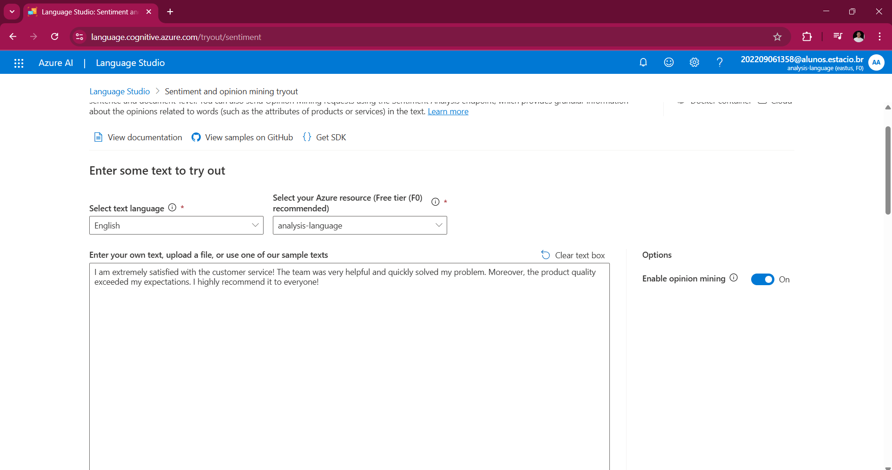
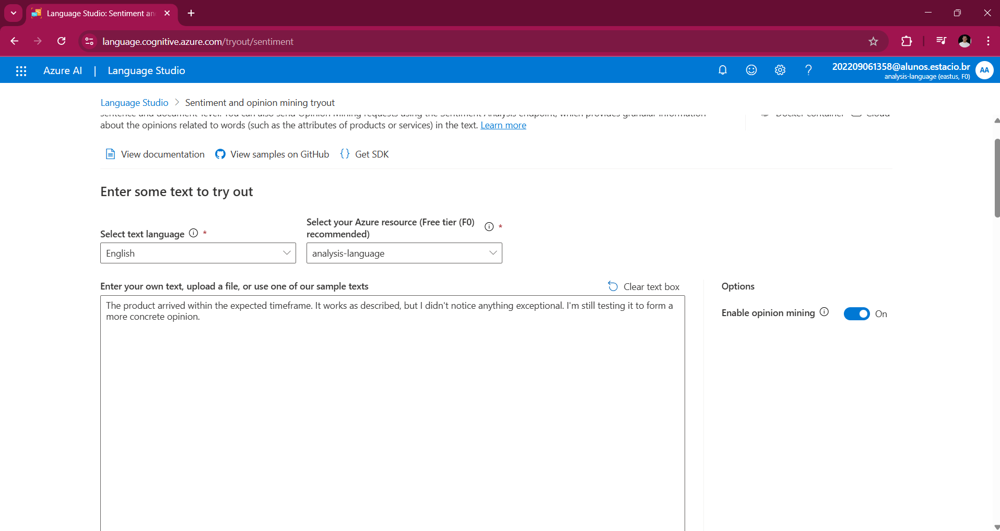
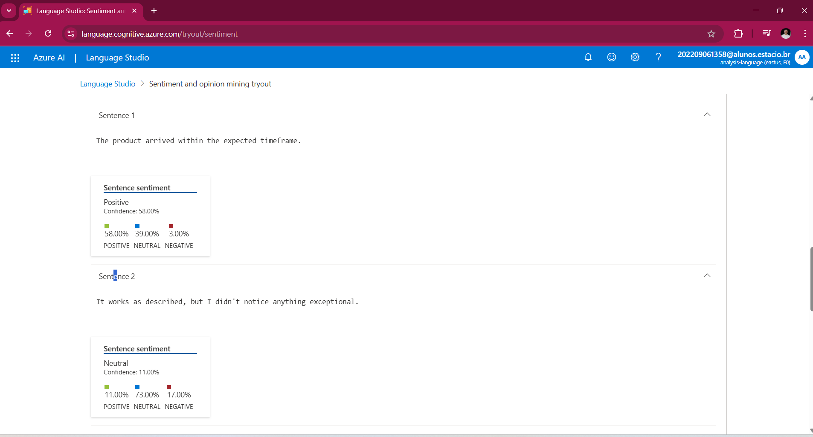
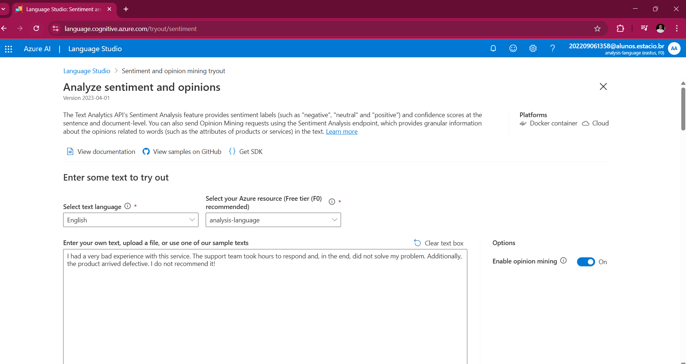
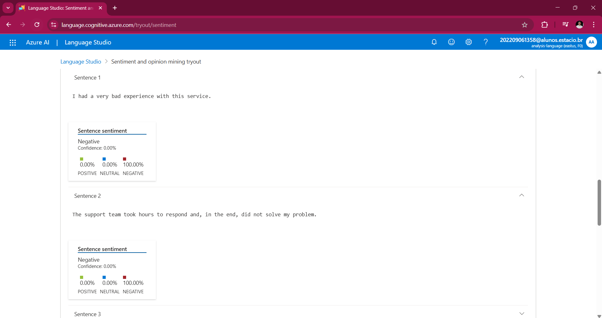

## 🔹 O que é o Azure AI Language Studio?  

O **Azure AI Language Studio** é um serviço de **Processamento de Linguagem Natural (NLP)** que permite a análise de textos para identificar **sentimentos, entidades, palavras-chave** e até mesmo realizar **tradução automática**. Ele é amplamente utilizado para tarefas como análise de sentimentos em feedbacks de clientes, extração de informações de documentos e categorização de textos.  

---

## 🔹 Como funciona o serviço?  

O serviço funciona através de **APIs que utilizam modelos de inteligência artificial pré-treinados** para processar textos de forma eficiente. Ele pode realizar as seguintes tarefas principais:  

✅ **Análise de Sentimento** – Identifica se um texto tem um tom **positivo, negativo ou neutro**.  
✅ **Extração de Entidades Nomeadas** – Identifica nomes de **pessoas, locais, organizações** e outros elementos importantes em um texto.  
✅ **Detecção de Linguagem** – Determina automaticamente o **idioma** do texto.  
✅ **Extração de Palavras-Chave** – Identifica **termos mais relevantes** no conteúdo analisado.  
✅ **Classificação de Texto** – Categoriza automaticamente o texto em diferentes **classes**.  
✅ **Reconhecimento de Identidades Pessoais Sensíveis (PII)** – Detecta informações sensíveis, como números de **CPF** ou **cartões de crédito**.  

Essas funcionalidades são acessíveis via **interface gráfica no Language Studio** ou através de **chamadas de API**.  

---

## 🔹 Passo a Passo para Usar o Serviço  

### **1️⃣ Criando o Serviço no Portal do Azure**  

1. Acesse o **[Portal do Azure](https://portal.azure.com/)**.  
2. Vá até **"Criar um Recurso"** e pesquise por **"Text Analytics"**.  
3. Escolha a opção **"Serviço de Linguagem"** e clique em **"Criar"**.  
4. Preencha as informações necessárias:  
   - **Grupo de Recursos**: Selecione ou crie um novo.  
   - **Região**: Escolha a mais próxima para melhor desempenho.  
   - **Plano de Preço**: Escolha o nível adequado de uso.  
5. Clique em **"Criar"** e aguarde a implantação do recurso.  

### **2️⃣ Configurando e Utilizando o Language Studio**  

1. Acesse o **[Azure Language Studio](https://language.azure.com/)**.  
2. Faça **login** com sua conta do Azure.  
3. Escolha o recurso de **Text Analytics** criado anteriormente.  
4. No menu, selecione a funcionalidade desejada (ex: **Análise de Sentimento**).  
5. Insira o texto a ser analisado e clique em **"Executar"**.  

---

## 🔍 Insights da Análise de Sentimentos e do Azure Language Studio  

A **Análise de Sentimentos** e o **Azure Language Studio** oferecem informações valiosas para empresas e desenvolvedores. Aqui estão alguns dos principais insights que podem ser extraídos:  

### **1️⃣ Insights a partir da Análise de Sentimentos**  

A análise de sentimentos usa **inteligência artificial** para identificar a **polaridade emocional** de um texto (**positivo, negativo ou neutro**). Isso permite:  

✅ **Monitoramento de Feedbacks de Clientes** – Empresas podem analisar avaliações de produtos e suporte ao cliente para entender a satisfação.  
✅ **Detecção de Problemas e Reclamações** – Ajuda a identificar reclamações recorrentes antes que se tornem problemas maiores.  
✅ **Otimização de Campanhas de Marketing** – Avalia a recepção de campanhas publicitárias e estratégias de comunicação.  
✅ **Análise de Redes Sociais** – Empresas podem monitorar menções de suas marcas para entender a percepção do público.  
✅ **Melhoria da Experiência do Usuário** – Insights sobre interações negativas ajudam na otimização de serviços e produtos.  

💡 **Exemplo:** Se uma empresa recebe muitas avaliações negativas sobre o tempo de resposta do suporte, pode identificar a necessidade de reforçar a equipe.  

---

### **2️⃣ Insights a partir do Azure Language Studio**  

Além da **análise de sentimentos**, o **Azure Language Studio** permite extrair informações valiosas de textos, como:  

✅ **Detecção de Tendências** – Identifica **palavras-chave e temas mais mencionados** em um conjunto de textos.  
✅ **Extração de Entidades Nomeadas** – Reconhece **nomes de empresas, produtos, locais** e mais, ajudando a entender padrões nos dados.  
✅ **Identificação de Dados Sensíveis (PII)** – Protege dados ao detectar informações pessoais, como números de **CPF, e-mails e telefones**.  
✅ **Automação de Processos** – **Categorização de textos e respostas automáticas** baseadas na análise do conteúdo.  

💡 **Exemplo:** Um **e-commerce** pode processar milhares de **avaliações de produtos** para encontrar tendências e melhorar a experiência do cliente.  

---

## Exemplos de Saída de Análise

- 1️⃣ Texto positivo

- 2️⃣ Texto neutro

- :three: Texto negativo

A análise através do formato JSON pode ser vista na pasta [input](https://github.com/AlcidesNet0/bootcamp-avanade/tree/main/desafio-06-analise-de-sentimentos-azure/inputs)

## 🔹 Conclusão  

O **Azure Language Studio** é uma ferramenta poderosa para análise de texto baseada em **IA**, permitindo que **desenvolvedores e empresas** extraiam insights de textos de forma rápida e eficiente. Ele pode ser usado via **interface gráfica** ou **API**, sendo útil para **análise de sentimentos, extração de entidades** e muito mais.  